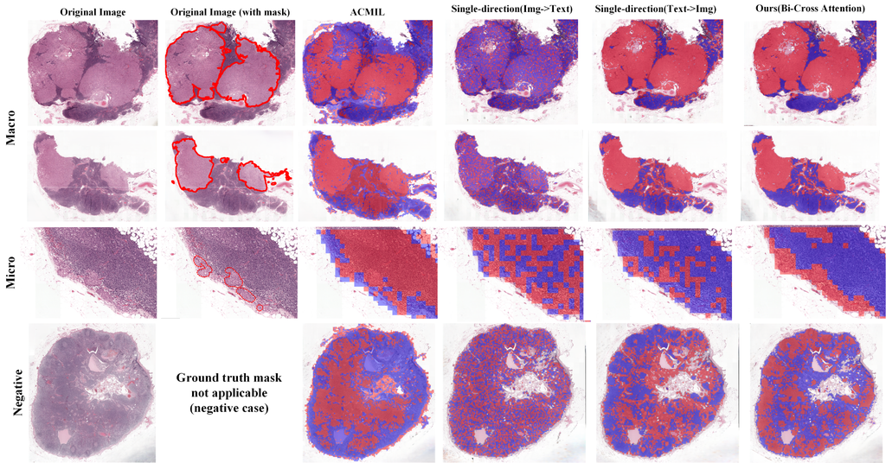

# Hierarchical Multimodal Fusion for Whole Slide Image Analysis

This repository contains the official implementation of our paper:

**Hierarchical Multimodal Fusion of Whole Slide Images and Text for Patient-Level Cancer Staging**

We propose a novel hierarchical framework that integrates whole slide images (WSIs) and GPT-generated textual prompts using Bi-Cross Attention for robust patient-level classification.
> If you need access to processed datasets or pretrained weights, feel free to contact me at [1074734511@qq.com](mailto:1074734511@qq.com).


---

## Table of Contents

- [Introduction](#introduction)
- [Model Architecture](#model-architecture)
- [Dataset](#dataset)
- [Installation](#installation)
- [Project Structure](#project-structure)
- [Usage](#usage)
- [Results](#results)
- [Citation](#citation)
- [License](#license)

---

## Introduction

Recent deep learning methods for WSI analysis rely heavily on MIL-based models that lack patient-level understanding.

In this work, we propose a **Multi-modal Hierarchical (MH)** framework that:
- Integrates WSI features with textual descriptions via **Bi-Cross Attention (BCA)**
- Aggregates slide-level features for **patient-level** prediction
- Uses contrastive learning and hierarchical fusion to improve interpretability

---

## Model Architecture


## Dataset
We evaluate our method on three publicly available datasets:
### 1.[CAMELYON17](https://camelyon17.grand-challenge.org/)
- Task: Lymph node metastasis classification
- Data level: Slide-level & Patient-level
- Source: Grand Challenge

### 2.[TCGA-BRCA](https://portal.gdc.cancer.gov/)
- Task: Breast cancer subtyping
- Subtypes: IDC (Invasive Ductal Carcinoma), ILC (Invasive Lobular Carcinoma)

### 3.[TCGA-NSCLC](https://portal.gdc.cancer.gov/)
- Task: Non-small cell lung cancer subtyping
- Subtypes: LUAD (Lung Adenocarcinoma), LUSC (Lung Squamous Cell Carcinoma)
  
Label Distribution
| Dataset       | Level         | Class Label     | Count |
|---------------|---------------|------------------|-------|
| **CAMELYON17** | Slide-level   | Negative         | 318   |
|               |               | ITC              | 36    |
|               |               | Micro            | 59    |
|               |               | Macro            | 87    |
| **CAMELYON17** | Patient-level | pN0              | 120   |
|               |               | pN0(i+)          | 55    |
|               |               | pN1mi            | 105   |
|               |               | pN1              | 150   |
|               |               | pN2              | 70    |
| **TCGA-BRCA**  | Patient-level | IDC              | 779   |
|               |               | ILC              | 198   |
| **TCGA-NSCLC** | Patient-level | LUAD             | 478   |
|               |               | LUSC             | 478   |

To extract features from WSIs, we follow the pipeline proposed by the [CLAM framework (Mahmood Lab)](https://github.com/mahmoodlab/CLAM/tree/master?tab=readme-ov-file#wsi-segmentation-and-patching), which includes tissue segmentation, patching, and feature extraction using ResNet.
- **CAMELYON17**
  - We use `CLAM/presets/bwh_biopsy.csv` as configuration
  - Extracted features are saved as `.h5` files
  - Saved under the folder: `./h5_files/`

- **TCGA (BRCA & NSCLC)**
  - We use `CLAM/presets/tcga.csv` as configuration
  - Extracted features are saved as `.pt` files
  - Saved under the folder: `./pt_files/`
    
  > If you want to reproduce feature extraction, please refer to CLAM’s [create_patches_fp.py](https://github.com/mahmoodlab/CLAM/blob/master/create_patches_fp.py) [extract features_fp.py](https://github.com/mahmoodlab/CLAM/blob/master/extract_features_fp.py) and modify the config CSVs accordingly.
  > 
## Installation
- Python >= 3.10
- PyTorch >= 2.3.0 (with CUDA 11.8 support)
- Torchvision == 0.18.0+cu118

- pip install -r requirements.txt

## Project Structure
Download the T5 weights from HuggingFace:

> [FLAN-T5 Small (google/flan-t5-small)](https://huggingface.co/google/flan-t5-small/tree/main)

After downloading, place the following files into:
/used_checkpoint/T5/

The whole structure are followed:
- `data_splits_stage_folds/`: CAMELYON17 slide & patient-level CSVs
- `data_splits_tcga_brca_folds/`: TCGA-BRCA subtype classification folds
- `data_splits_tcga_nsclc_folds/`: TCGA-NSCLC subtype classification folds
- `text/`: GPT-generated textual descriptions per class
- `used_checkpoint/`: Pretrained weights and downloaded T5 model files
- `h5_files/`: Extracted HDF5 features from WSIs
- `pt_files/`: Saved `.pt` model checkpoints

**Core Scripts**
- `dataloader.py`: Data loading and transformation
- `main.py`: Entry point for training and evaluation
- `model.py`: HMF model architecture with Bi-Cross Attention
- `train.py`: Training loop, scheduler, optimizer
- `test.py`: Test script for model evaluation
- `utils.py`: Utility functions

## Usage
### CAMELYON17
If you're using **Windows (single GPU)**:
```bash
python main.py --task_target 'camelyon' --h5_path 'your_h5_directory'
```

If you're using multi-GPU setup (e.g., 2 GPUs):
```bash
torchrun --nproc_per_node=2 main.py --task_target 'camelyon' --h5_path 'your_h5_directory'
```

### TCGA Subtyping(BRCA/NSCLC) Windows for example
BRCA:
```bash
python main.py --task_target 'tcga' --subtyping_task 'brca' --h5_path 'your_h5_directory'
```
NSCLC:
```bash
python main.py --task_target 'tcga' --subtyping_task 'nsclc' --h5_path 'your_h5_directory'
```
### Evaluate/Test
Evaluate a trained model using saved checkpoint:
```bash
python test.py --checkpoint used_checkpoint/model_epochX.pth
```
The extra Arguments:
### Arguments

| Argument               | Description                                       | Example                                  |
|------------------------|---------------------------------------------------|------------------------------------------|
| `--task_target`        | Task type: `camelyon` or `tcga`                   | `--task_target camelyon`                 |
| `--subtyping_task`     | (For TCGA only) Subtype: `brca` or `nsclc`        | `--subtyping_task brca`                  |
| `--fold`               | Fold index for cross-validation (1–5)             | `--fold 1`                                |
| `--ratio`              | Attention filter ratio (range: 0.1 to 0.9)        | `--ratio 0.5`                             |
| `--h5_path`            | Path to `.h5` feature files                       | `--h5_path ./h5_files/`                   |
| `--pt_path`            | Path to `.pt` feature files                       | `--pt_path ./pt_files/`                   |
| `--accumulation_steps` | Gradient accumulation steps to reduce GPU usage   | `--accumulation_steps 5`                 |

## Results

Slide-level classification on CAMELYON17 (4 classes: negative, ITC, micro, macro).

| Model          | Accuracy       | Precision      | Recall         | F1             |
|----------------|----------------|----------------|----------------|----------------|
| Mean-pooling   | 0.603 ± 0.083  | 0.353 ± 0.015  | 0.352 ± 0.021  | 0.332 ± 0.016  |
| Max-pooling    | 0.736 ± 0.071  | 0.513 ± 0.028  | 0.527 ± 0.029  | 0.506 ± 0.028  |
| GATMIL         | 0.560 ± 0.083  | 0.140 ± 0.021  | 0.135 ± 0.097  | 0.179 ± 0.016  |
| DSMIL          | 0.637 ± 0.089  | 0.527 ± 0.018  | 0.391 ± 0.021  | 0.392 ± 0.016  |
| Trans-MIL      | 0.683 ± 0.089  | 0.462 ± 0.068  | 0.474 ± 0.124  | 0.441 ± 0.086  |
| DTFD (MaxS)    | 0.591 ± 0.083  | 0.319 ± 0.014  | 0.314 ± 0.021  | 0.297 ± 0.016  |
| DTFD (MaxMinS) | 0.633 ± 0.083  | 0.419 ± 0.022  | 0.372 ± 0.021  | 0.380 ± 0.016  |
| DTFD (AFS)     | 0.620 ± 0.083  | 0.397 ± 0.011  | 0.368 ± 0.021  | 0.366 ± 0.016  |
| ACMIL          | 0.773 ± 0.084  | 0.601 ± 0.041  | 0.621 ± 0.114  | 0.615 ± 0.060  |
| **Ours**       | **0.840 ± 0.072** | **0.725 ± 0.194** | **0.694 ± 0.109** | **0.687 ± 0.132** |

Aggregated patient-level classification on CAMELYON17 (5 classes: pN0, pN0(i+), pN1mi, pN1, pN2).

| Method            | Accuracy       | Precision      | Recall         | F1-score       |
|-------------------|----------------|----------------|----------------|----------------|
| Mean-pooling      | 0.600 ± 0.084  | 0.306 ± 0.088  | 0.388 ± 0.083  | 0.347 ± 0.063  |
| Max-pooling       | 0.560 ± 0.018  | 0.304 ± 0.073  | 0.433 ± 0.076  | 0.360 ± 0.078  |
| Sum-pooling       | 0.575 ± 0.085  | 0.341 ± 0.035  | 0.453 ± 0.018  | 0.347 ± 0.016  |
| Min-pooling       | 0.467 ± 0.047  | 0.227 ± 0.044  | 0.372 ± 0.096  | 0.278 ± 0.067  |
| Attention-pooling | 0.552 ± 0.056  | 0.314 ± 0.047  | 0.345 ± 0.051  | 0.297 ± 0.079  |
| **Ours (bias term)** | **0.633 ± 0.058** | **0.345 ± 0.096** | **0.456 ± 0.082** | **0.371 ± 0.062** |

## Visualization



## Citation

If you find this repository useful for your research, please cite:

```bibtex
@article{yao2025hmf,
  title   = {Hierarchical Multimodal Fusion of Whole Slide Images and Text for Patient-Level Cancer Staging},
  author  = {Yao, Junxiang and Others},
  journal = {Information Fusion},
  year    = {2025},
  note    = {Under Major Revision}
}
```
## License

Copyright (c) 2025 Junxiang Yao

Permission is hereby granted, free of charge, to any person obtaining a copy
of this software and associated documentation files (the "Software"), to deal
in the Software without restriction, including without limitation the rights
to use, copy, modify, merge, publish, distribute, sublicense, and/or sell
copies of the Software, and to permit persons to whom the Software is
furnished to do so, subject to the following conditions:

The above copyright notice and this permission notice shall be included in all
copies or substantial portions of the Software.

THE SOFTWARE IS PROVIDED "AS IS", WITHOUT WARRANTY OF ANY KIND, EXPRESS OR
IMPLIED, INCLUDING BUT NOT LIMITED TO THE WARRANTIES OF MERCHANTABILITY,
FITNESS FOR A PARTICULAR PURPOSE AND NONINFRINGEMENT. IN NO EVENT SHALL THE
AUTHORS OR COPYRIGHT HOLDERS BE LIABLE FOR ANY CLAIM, DAMAGES OR OTHER
LIABILITY, WHETHER IN AN ACTION OF CONTRACT, TORT OR OTHERWISE, ARISING FROM,
OUT OF OR IN CONNECTION WITH THE SOFTWARE OR THE USE OR OTHER DEALINGS IN THE
SOFTWARE.


